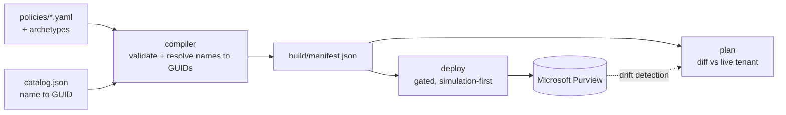

# DLPaC: Data Loss Prevention as Code

DLPaC treats data loss prevention policy as source code rather than as portal configuration.
Policies are written in a small YAML language, compiled and validated offline into an
intermediate representation, and applied to a tenant through a reviewable, simulation-first
pipeline. The argument it makes is not specific to any vendor, but the argument needs a working
implementation to be worth anything, so the current backend targets Microsoft Purview.

**Contents**

- **Part I: Rationale.** [1. Position](#1-position) · [2. Related work](#2-related-work) · [3. Design principles](#3-design-principles)
- **Part II: System.** [4. The pipeline](#4-the-pipeline) · [5. Notes on the substrate](#5-notes-on-the-substrate) · [6. The language](#6-the-language) · [7. The natural-language layer](#7-the-natural-language-layer) · [8. Safety model and non-guarantees](#8-safety-model-and-non-guarantees) · [9. Beyond Purview](#9-beyond-purview)
- **Part III: Practice.** [10. Working offline](#10-working-offline) · [11. Deploying to Purview](#11-deploying-to-purview) · [12. Using the assistant](#12-using-the-assistant) · [13. Repository layout](#13-repository-layout) · [14. Open problems](#14-open-problems)

---

# Part I: Rationale

## 1. Position

A data loss prevention policy is a predicate over data flows. It decides, for every message, file,
upload, and prompt crossing a boundary, whether that flow is permitted. That is a program. It is
almost universally authored by clicking through a web form.

The usual objection to portal administration is ergonomic: no version history, no peer review, no
diff. Those complaints are true and they are not the interesting ones. The interesting problem is
that DLP has no natural failure signal.

Consider what happens when a rule is wrong. A misconfigured firewall drops traffic and someone
files a ticket within the hour. A misconfigured DLP rule matches nothing, and nothing happens.
No error is raised, no alert fires, no user is blocked, and the dashboard shows zero policy
violations, which is exactly what a correctly functioning policy over clean traffic also shows.
The two states are observationally identical from the console. A control whose failure mode is
silence cannot be validated by watching it run, and an organization can hold a policy it believes
is protecting a data class for years without that belief ever being tested.

This is why the feedback loops that eventually discipline other kinds of configuration never
engage here. There is no failing test to notice, no page at 3am, no user complaint. The only
mechanisms that can catch a wrong DLP policy are the ones applied before it is deployed: static
validation, review by someone other than the author, and an explicit staged rollout. All three are
properties of a build pipeline, and none of them are properties of a web form.

There is a second, quieter cost. Purview's unified audit log records that a policy changed and who
changed it, which is genuinely useful for forensics and useless for review. It captures the
mutation and discards the reasoning. Six months later the question is never "who edited this rule"
but "why is the confidence threshold Medium here and High everywhere else", and that answer was
never written down, because the interface that accepted the change had nowhere to put it. A commit
message and a pull request discussion are not process overhead; they are the only durable record
of intent that the system will ever have.

The position of this project follows from those two observations. A data protection control plane
should be a compiler target, not a user interface. Policies should be written in a language with a
schema, checked by a validator that fails loudly, stored where they can be diffed and reviewed,
and applied by a machine that does exactly and only what the source says. The portal becomes a
read-only view of a state that is authored somewhere else.

Purview is where that claim is demonstrated here. It is not what the claim is about.

## 2. Related work

The idea is an application of a pattern, not an invention. Infrastructure moved to code with CFEngine
and later Terraform and Pulumi. Detection engineering moved with Sigma and the detection-as-code
tooling built around it. Authorization policy moved with Open Policy Agent and Kyverno. Compliance
benchmarking moved with OpenSCAP and InSpec. Each transition followed the same arc: a domain
administered through consoles, a growing gap between what operators believed was configured and
what was, and eventually a declarative source of truth with a compiler and a diff.

Data loss prevention has been unusually resistant to this transition, and it is worth being precise
about the closest existing work rather than claiming empty territory.

[Microsoft365DSC](https://microsoft365dsc.com/) is the most direct prior art. It exposes DLP through
PowerShell Desired State Configuration resources, including
[`SCDLPCompliancePolicy`](https://microsoft365dsc.com/resources/security-compliance/SCDLPCompliancePolicy/)
and [`SCDLPComplianceRule`](https://microsoft365dsc.com/resources/security-compliance/SCDLPComplianceRule/),
and it can export and reapply tenant configuration. Anyone evaluating DLPaC should evaluate it
first, because for broad tenant configuration management it does more.

The difference is one of altitude, and it cuts both ways. Microsoft365DSC is a general-purpose,
resource-oriented mirror of the underlying cmdlet surface across the whole of Microsoft 365: its
DLP resources take the cmdlet parameters more or less as they are. DLPaC is narrow by comparison,
covering DLP alone, and buys three things with that narrowness. Detection is authored structurally
rather than as a hand-built `AdvancedRule` blob, which remains an
[open issue](https://github.com/microsoft/Microsoft365DSC/issues/3455) in the DSC resources.
References are written as human names and resolved to GUIDs at build time, so an unresolvable name
is a build failure rather than a silently inert policy. And simulation is a first-class stage in
the workflow rather than a property you happen to set.

Those are trade-offs, not a verdict. A general resource provider and a domain-specific language are
different tools, and the second is only worth building if the domain has enough structure to
justify a language of its own. Section 5 is the argument that DLP does.

## 3. Design principles

**1. Resolution fails closed.** Purview matches on GUIDs; humans think in names. The compiler maps
names to GUIDs from `catalog/catalog.json`, and a name that is not in the catalog terminates the
build. This is a direct consequence of Section 1: the worst outcome for a DLP policy is not an
error, it is a policy that deploys cleanly and matches nothing. Given the choice between failing at
build time and shipping something inert, the build must fail. Every reference type resolves this
way, including sensitive information types, sensitivity labels, groups, and SharePoint sites.

**2. Simulation is a stage, not a setting.** Purview's test modes exist, but nothing about the portal
makes staged rollout the default path. Here, `TestWithoutNotifications` and `TestWithNotifications`
deploy freely while `Mode: Enable` is refused unless enforcement is explicitly and separately
authorized. The gate is in the deploy engine, not in documentation, so the ordering cannot be
skipped by an operator in a hurry.

**3. The manifest is an intermediate representation.** `build/manifest.json` is not a cache or a log.
It is the IR of a three-stage compiler: YAML source is the front end, the manifest is the IR, and
the PowerShell deploy engine is the code generator for one target. Naming it this way is a design
commitment rather than a metaphor. The manifest is fully determined by the source and the catalog,
it can be inspected and diffed without tenant access, and it is the only interface the backend is
allowed to depend on.

**4. The front end is provider-agnostic; only the backend is not.** The language, schema, resolver,
and compiler contain no Purview API calls and no tenant access. This is what makes the entire
authoring and validation path runnable offline on any operating system, and it is the precondition
for the portability discussed in Section 9.

**5. Nothing reaches the tenant without passing through review.** Every change, whether typed by a
human or drafted by a model, arrives as a pull request. This is the only mechanism that captures
intent, and per Section 1 it is one of the few controls that can catch a wrong policy at all.

---

# Part II: System

## 4. The pipeline



Each stage has a fixed contract:

| Stage | Entry point | Input | Output | Tenant access | Host |
|---|---|---|---|---|---|
| Author | `policies/*.yaml` | prose requirement | YAML policy | none | any |
| Compile | `compiler/compile.py` | policies, archetypes, catalog | `build/manifest.json` | none | any |
| Plan | `powershell/Invoke-Plan.ps1` | manifest | diff report | read-only | Windows |
| Deploy | `powershell/Invoke-Deploy.ps1` | manifest | tenant mutation | read/write | Windows |
| Drift | `powershell/Export-DlpConfig.ps1` | live tenant | export, then a PR on divergence | read-only | Windows |

Compilation merges any referenced archetype beneath the policy, validates the result against
`compiler/schema/policy.schema.json`, resolves every friendly name to its GUID, and emits both the
cmdlet envelope parameters and the `AdvancedRule` JSON for each rule.

The Windows requirement is imposed by `Connect-IPPSSession`, which Security & Compliance PowerShell
only ships for Windows. It applies to the three tenant-facing stages and to nothing else. The
compiler and the test suites are pure Python and run anywhere, which is why `validate` runs on
Linux in CI while `plan`, `deploy`, and `drift` run on `windows-latest`.

## 5. Notes on the substrate

A declarative model is only as good as its fidelity to the system it abstracts, and that fidelity
is not obtainable from vendor documentation. The behaviours below were established empirically
against a live tenant. Each one forced a change in the deploy engine, and together they are the
strongest available argument that DLP is structured enough to deserve a compiler: these are not
incidental quirks, they are constraints that any correct implementation has to encode.

**Finding 1. `Set-DlpComplianceRule -AdvancedRule` is rejected.** The service returns a generic
server-side error. There is no supported path to update the detection logic of an existing
`AdvancedRule` rule in place.

**Finding 2. `Remove-DlpComplianceRule` is asynchronous.** A removed rule does not disappear. It
enters `Mode=PendingDeletion` and remains visible for some time, and creating a rule with the same
name while it lingers fails with an "already exists" error.

*Consequence of 1 and 2.* Rule reconciliation is create-or-leave, never update. Since a rule cannot
be modified and cannot be safely replaced, an existing rule is left untouched. Changing detection
logic means giving the rule a new name. A rule found in `PendingDeletion` is skipped and its policy
is reported incomplete rather than being retried into a guaranteed failure. This is the single
largest concession the design makes to the substrate, and Section 14 treats the ergonomic cost as
unresolved.

**Finding 3. Policy and rule names are case-insensitive.** `My-Rule` and `my-rule` are the same
object. Name comparison during reconciliation is therefore case-insensitive throughout, since a
case-sensitive lookup would conclude a rule is absent and then fail to create it as a duplicate.

**Finding 4. Microsoft 365 Copilot uses a different creation shape.** Copilot is a DLP location, but
it is not addressed by an `-XLocation` parameter like every other surface. It requires a
`-Locations` JSON document specifying `Workload="Applications"` and `Location="Copilot.M365"`, with
one `IndividualResource` inclusion per in-scope user, together with
`-EnforcementPlanes @("CopilotExperiences")`.

**Finding 5. A Copilot rule must carry a restrict action.** Creation without one fails with
`ErrorMissingRestrictActionForCopilotException`. The parameter is typed `Hashtable[]`, so the
compiler emits `RestrictAccess = @(@{value="Block"})`. The value-only shape is deliberate: adding a
`setting` key alongside a `HasActivity` condition is rejected with
`InvalidRestrictAccessActionWithHasActivityCondition`, while the value-only form is accepted either
way.

**Finding 6. Deployment scripts must be pure ASCII.** Windows PowerShell 5.1 reads a script without a
byte-order mark as ANSI. A single non-ASCII byte inside a string literal, such as a typographic dash
pasted from a document, corrupts parsing in ways whose error messages point nowhere near the actual
cause. All files under `powershell/` are constrained to ASCII and checked.

Two engine-level behaviours follow from operating against a service that fails this way. A policy
that errors is recorded and skipped rather than aborting the run, since one malformed policy should
not prevent nine correct ones from deploying; the run reports `N deployed, N skipped, N failed` and
exits non-zero if any failed. Pruning of undeclared rules is suppressed unless every desired rule is
confirmed in place, so that a partially reconciled policy is never stripped down to no rules at all.
The enforcement gate is the one condition that halts the entire run.

## 6. The language

A policy is a single YAML document. The schema at `compiler/schema/policy.schema.json` is
authoritative; [`docs/dsl-reference.md`](docs/dsl-reference.md) documents every field.

```yaml
name: block-external-pci-exchange
archetype: group-scoped-simulation      # inherits simulation mode and pilot-group scope
description: Block credit-card data emailed outside the org.
locations:
  exchange: true
rules:
- name: block-external-pci-exchange-Financial
  detect:
    accessScope: NotInOrganization
    groups:
    - name: Financial
      sensitiveTypes:
      - {name: Credit Card Number, confidence: High}
  actions:
    blockAccess: true
    generateIncidentReport: true
```

Archetypes in `archetypes/` carry reusable defaults, so a pattern such as "simulation only, fenced
to a pilot group" is written once and inherited, with policy keys overriding archetype keys.

The language does not cover everything Purview's `AdvancedRule` grammar can express, and pretending
otherwise would produce a language that is either endless or dishonest. The `rawAdvancedRule` field
is a deliberate escape hatch: it accepts a verbatim `AdvancedRule` JSON string with GUIDs already
embedded, bypassing structured authoring and name resolution. Its presence is a concession rather
than a gap. A DSL over a large vendor surface without an escape hatch forces users to abandon the
tool entirely the first time they need something it cannot say, and an escape hatch that is
documented and narrow is better than a language that quietly cannot be adopted. Policies using it
give up fail-closed resolution for that rule, which is the cost, and it is why the field exists at
the rule level rather than the policy level.

## 7. The natural-language layer

An assistant layer turns plain-English requests into policy drafts and answers questions about
existing coverage. This is the part of the system where a stated design position matters most,
because the obvious objection to pointing a language model at security policy is the correct one:
models produce plausible output, and plausible is precisely the failure mode Section 1 identified as
undetectable.

The design claim is that model output is untrusted input, and the compiler is the trust boundary.

`assistant/validator.py` pushes every draft through `compile_policy`, the same function a
hand-written policy goes through, along the same path: YAML parse, archetype merge, schema
validation, fail-closed name resolution, `AdvancedRule` construction. A draft that does not survive
that path cannot become a pull request. The model is therefore not trusted to produce correct
policy. It is trusted only to produce a candidate, and every property the compiler enforces for
human authors is enforced identically for it. A hallucinated sensitive information type is not a
subtle downstream bug; it is a `ResolutionError` at the same line of the same resolver that would
reject a human typo.

The model itself is a replaceable component. `Brain` in `assistant/brain.py` is the single interface
a backend implements, with three implementations behind it: `LocalBrain` for any OpenAI-compatible
endpoint such as Ollama or vLLM, `ClaudeBrain` for the Anthropic API, and `DryRunBrain`, which
implements the interface while calling no model at all. `DryRunBrain` matters more than it appears
to. It emits a real, schema-valid, resolvable draft, which means the entire path from context
assembly through validation can be exercised with no API key, no network, and no cost, and it is
what makes the layer testable rather than merely demonstrable.

Whether a given model is good enough is treated as an empirical question. `assistant/eval.py` runs
each golden-example request through a brain, pushes every draft through the real compiler, and
reports a compile rate, along with the requests where the model asked a clarifying question instead
of guessing. It exits non-zero if any produced draft fails to compile, so it can serve as a CI gate.

The limitation is stated plainly in the tool itself: compile rate measures form, not intent. It
answers whether a draft would deploy, not whether it does what was asked. A policy that compiles
perfectly and watches the wrong sensitive information type is exactly the silent failure this
project exists to prevent, and no automated check in this repository detects it. That is what the
mandatory pull request is for. The compiler establishes that a draft is well-formed and deployable;
a human establishes that it is right.

## 8. Safety model and non-guarantees

The controls are as follows. Authored policies are simulation-first, and enforcement requires a
separate authorized run. Resolution fails closed, so unknown references break the build. Every
change lands through a pull request, and the deploy environment can require reviewers.
Authentication is app-only through GitHub OIDC, `azure/login`, and a certificate held in Azure Key
Vault, so no secret is stored in the repository.

What this does not give you matters just as much:

- **Drift is detected, not prevented.** Nothing stops an administrator editing a policy in the
  portal. The scheduled export notices divergence after the fact, on a daily cadence by default, and
  opens a pull request. Between the edit and the next run, the tenant and the repository disagree
  and nothing is aware of it.
- **The compiler cannot validate detection efficacy.** It proves a sensitive information type exists
  and resolves to a GUID. Whether that type matches your actual data, at the confidence level you
  chose, is outside what any offline check can determine.
- **Simulation telemetry is not consumed.** Policies deploy in test mode, but the match counts that
  mode produces are not read back, so the decision to enforce is still made by a human reading a
  portal rather than by evidence flowing through the pipeline.
- **The enforcement gate is a process control.** It stops an accidental enforcement, not a determined
  operator with tenant permissions.
- **A draft that compiles is not a draft that is correct.** See Section 7.

## 9. Beyond Purview

Section 1 makes a claim about control planes generally, so the question of whether this generalizes
is fair. Part of the answer is already settled by the architecture and part of it is honestly not.

What is provider-independent today is a matter of fact rather than intent. The language, the JSON
Schema, the resolver, the compiler, and the manifest contain no Purview API calls, no cmdlet
invocations, and no tenant access. The entire front end runs offline on any operating system, and
the tests exercise it without credentials. Everything Purview-specific lives under `powershell/` and
consumes the manifest through a documented contract. A second backend would be a new code generator
reading the same IR, not a fork.

What is not yet general is equally concrete, and lives in the vocabulary rather than the structure.
`rawAdvancedRule` is explicitly a Purview escape hatch and would have no meaning elsewhere. The
catalog is built around Purview's identifiers for sensitive information types and sensitivity
labels. The Copilot surface described in Findings 4 and 5 is a Microsoft product. Some concepts in
the language are plainly universal, including detection over sensitive data types, scoping,
enforcement actions, and staged rollout; others are Purview's model showing through.

The honest statement is that the pipeline architecture generalizes and the language has not yet been
tested against a second target. Writing one backend proves nothing about portability. The plausible
candidates are Google Workspace DLP, endpoint and network vendors such as Netskope or Zscaler, and
cloud-native scanners such as AWS Macie, and doing any of them is what would force the separation of
universal concepts from Purview's. That work is listed in Section 14 rather than claimed here.

---

# Part III: Practice

## 10. Working offline

The compiler and both test suites require no tenant, no credentials, and no network. Python 3.10 or
later is required, since `jsonschema==4.26.0` does not support earlier versions; CI runs 3.12.

```sh
python3.12 -m venv .venv && . .venv/bin/activate
pip install -r requirements.txt

python compiler/compile.py          # policies -> build/manifest.json
python tests/test_compiler.py       # compiler unit tests
python tests/test_assistant.py      # assistant unit tests
```

To author a policy, add a YAML file to `policies/` using the form shown in Section 6 and recompile.
A reference that is not in `catalog/catalog.json` will fail the build with the name that could not
be resolved. Existing examples cover label-based detection, financial identifiers, a Copilot-scoped
policy, and a `rawAdvancedRule` passthrough.

## 11. Deploying to Purview

Authentication is app-only: GitHub OIDC to `azure/login`, a certificate pulled from Azure Key Vault,
then `Connect-IPPSSession`. Set these as repository variables:

`AZURE_CLIENT_ID`, `AZURE_TENANT_ID`, `AZURE_SUBSCRIPTION_ID`, `KEY_VAULT_NAME`, `CERT_NAME`,
`M365_ORGANIZATION`.

`powershell/Connect-Dlp.ps1` must be dot-sourced before the plan or deploy scripts in the same
process, since it exports `DLP_CERT_THUMBPRINT` for them to use.

Four workflows implement the pipeline:

| Workflow | Trigger | Runner | Effect |
|---|---|---|---|
| `validate` | push and pull request | `ubuntu-latest` | compile and test; no tenant access |
| `plan` | pull request | `windows-latest` | read-only diff of manifest against the tenant |
| `deploy` | manual dispatch | `windows-latest` | applies the manifest |
| `drift` | daily cron | `windows-latest` | exports the tenant, opens a PR on divergence |

Enforcement is gated in two places. `deploy` takes an `allow_enforce` input which sets
`DLP_ALLOW_ENFORCE`, and `Invoke-Deploy.ps1` refuses any policy with `Mode: Enable` unless that
variable equals `true`, halting the run rather than skipping the policy. Simulation modes are
unaffected. Point the workflow at a protected `deploy` environment with required reviewers to make
enforcement a human decision as well as a flagged one.

The deploy run reports `N deployed, N skipped, N failed` and exits non-zero if any policy failed.
Skipped means the policy was processed but left incomplete, which in practice means a rule was in
`PendingDeletion` per Finding 2 and the run should be repeated once the service finishes.

Refresh the catalog from your own tenant with `powershell/Update-Catalog.ps1`. The sensitive
information type GUIDs shipped in `catalog/catalog.json` are Microsoft's global built-in
identifiers and are the same in every tenant; groups, sensitivity labels, sites, and custom types
are placeholders and must be replaced.

## 12. Using the assistant

The backend is chosen by environment variable, and the layer runs with no model at all by default.

```sh
# No model: exercises the full path with no key, network, or cost
DLPAC_BRAIN=dry-run python -m assistant.eval

# Local OpenAI-compatible endpoint (Ollama, LM Studio, vLLM)
export DLPAC_BRAIN=local
export DLPAC_LOCAL_BASE_URL=http://localhost:11434/v1
export DLPAC_LOCAL_MODEL=qwen2.5-coder:14b

# Anthropic API
export DLPAC_BRAIN=claude ANTHROPIC_API_KEY=...
pip install anthropic       # optional dependency, required only for this backend

python -m assistant.eval --show-drafts
```

`--show-drafts` prints each generated policy so intent can be reviewed by eye, which per Section 7 is
the part no automated check covers.

## 13. Repository layout

```
compiler/      schema, validator, name-to-GUID resolver, compiler
catalog/       sample catalog (global built-in SIT GUIDs; placeholders elsewhere)
archetypes/    reusable policy defaults
policies/      example policies
powershell/    Connect, Plan, Deploy, Export, Update-Catalog, Remove (Windows only)
assistant/     natural-language layer: brain interface, backends, validator, eval
tests/         unit tests, no tenant access
docs/          DSL reference
.github/       validate, plan, deploy, drift workflows
```

## 14. Open problems

These are unsolved, not scheduled.

**Rule immutability.** Findings 1 and 2 mean detection logic cannot be edited, only renamed. This is
correct with respect to the service and unpleasant to live with, since it turns a one-character
threshold change into a rename that breaks continuity of the rule's history. Whether a
compiler-managed naming scheme could hide this without becoming a leaky abstraction is unresolved.

**Scope reconciliation.** Location and scope changes on an existing policy are not reconciled. The
deploy engine updates mode and comment and reports that it has not touched scoping. Correcting this
requires knowing which scope mutations the service accepts in place, which is another empirical
question of the kind Section 5 catalogues.

**Closing the simulation loop.** The pipeline can deploy a policy in test mode but cannot read back
what it matched. Consuming that telemetry would let the enforcement decision be made from evidence,
and would turn simulation from a safety convention into a measurement.

**Intent evaluation.** Compile rate measures form. Nothing measures whether a generated policy
expresses the request. This may require golden pairs of request and intended detection semantics,
compared structurally rather than textually.

**A second backend.** The portability claim in Section 9 is architectural and untested. Only
implementing a non-Purview target would establish which parts of the language are universal.

**Catalog freshness.** The catalog is refreshed manually. A stale catalog cannot cause a wrong
policy, since resolution fails closed, but it does cause build failures whose real cause is
staleness rather than the policy being compiled.

## Contributing

Issues and pull requests are welcome. The compiler, the assistant, and both test suites run with no
tenant access, so most contributions can be developed and verified entirely offline. Changes under
`powershell/` must remain pure ASCII for the reason given in Finding 6.

## License

[MIT](LICENSE).
