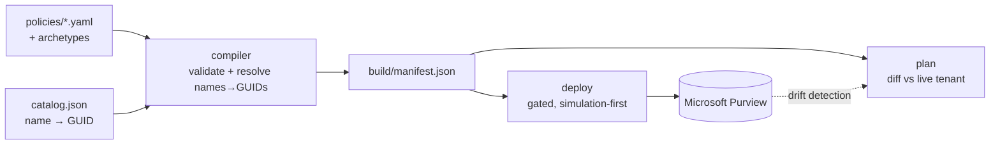

# DLPaC — Data Loss Prevention as Code

Manage **Microsoft Purview DLP** policies and rules as version-controlled, reviewable, testable
code. Author policies in a small YAML DSL, compile and validate them offline, and deploy through
a gated, simulation-first GitHub Actions pipeline — the detection-as-code / GitOps model applied
to data loss prevention.

> **Why this exists.** DLP is almost always managed by clicking around the Purview portal: no
> version history, no peer review, no diff before a change, no CI, no way to know when someone
> edited a rule out from under you. Infrastructure, detections, and policy have all moved to code
> — DLP mostly hasn't. DLPaC closes that gap.

## What you get

- **A YAML DSL** for DLP policies — surfaces (Exchange, Teams, SharePoint/OneDrive, Endpoint,
  Copilot), sensitive-info-type and sensitivity-label detection, access scope, and the full set of
  rule actions (block, notify, alert, incident report).
- **A compiler** (pure Python, runs anywhere) that validates every policy against a JSON Schema and
  resolves friendly names to the GUIDs Purview requires — **fail-closed**: an unknown SIT/label/group
  name is a hard build error, never a policy that silently matches nothing.
- **Reusable archetypes** so common patterns (e.g. "simulation-only, scoped to a pilot group") are
  written once and inherited.
- **A deploy pipeline** — idempotent create/update via Security & Compliance PowerShell, with a
  read-only **plan/diff**, scheduled **drift detection** (opens a PR when the tenant is edited
  out-of-band), and a hard **enforcement gate** (a policy can't flip to `Enable` without an explicit,
  separately-approved run).
- **A natural-language assistant** *(v2, experimental — see below)* that answers "do we cover X?"
  and drafts new policies from plain English, with your choice of **Claude or a local model**.

## Architecture



The compiler is provider-agnostic and needs no tenant access — you can author, validate, and test
entirely offline. Only the deploy/plan/drift steps touch Purview, and those run on Windows
(Security & Compliance PowerShell is Windows-only).

## Quickstart (offline — no tenant needed)

```sh
python -m venv .venv && . .venv/bin/activate
pip install -r requirements.txt

python compiler/compile.py          # compile the example policies -> build/manifest.json
python tests/test_compiler.py       # unit tests (no tenant access)
```

Author a policy by dropping a YAML file in `policies/`. Minimal example:

```yaml
name: block-external-pci-exchange
archetype: group-scoped-simulation      # inherits simulation mode + pilot-group scope
description: Block credit-card data emailed outside the org.
locations:
  exchange: true
rules:
- name: block-external-pci-exchange-Financial
  detect:
    accessScope: NotInOrganization
    groups:
    - name: Financial
      sensitiveTypes:
      - {name: Credit Card Number, confidence: High}
  actions:
    blockAccess: true
    generateIncidentReport: true
```

See [`policies/`](policies/) for more examples (label detection, financial identifiers, and a
`rawAdvancedRule` passthrough for complex detection the structured form doesn't cover yet), and
[`docs/dsl-reference.md`](docs/dsl-reference.md) for the full DSL.

## Deploying to Purview

Deployment uses app-only authentication: GitHub OIDC → `azure/login` → a certificate pulled from
Azure Key Vault → `Connect-IPPSSession`. Set these as repository **variables**:

`AZURE_CLIENT_ID`, `AZURE_TENANT_ID`, `AZURE_SUBSCRIPTION_ID`, `KEY_VAULT_NAME`, `CERT_NAME`,
`M365_ORGANIZATION`.

Then:

- **`plan`** (on PRs) — compiles the desired state and diffs it against the live tenant, read-only.
- **`deploy`** (manual) — idempotent apply. Simulation modes deploy freely; `Mode: Enable` is
  refused unless you pass `allow_enforce: true`. Point it at a protected `deploy` environment with
  required reviewers to force human approval.
- **`drift`** (scheduled) — exports the tenant and opens a PR if it has diverged from the committed
  policies.

Update the reference catalog (SIT/label/group/site name→GUID map) from your tenant with
`powershell/Update-Catalog.ps1`.

> **Safety model:** policies are simulation-first (`TestWithoutNotifications` /
> `TestWithNotifications`); enforcement is a separate, explicitly-gated step; the resolver fails
> closed; and every change goes through a pull request.

## The assistant (v2 — experimental, in active development)

DLPaC includes a natural-language layer that turns requests into schema-valid policy drafts and
answers coverage questions — always producing a **pull request** a human reviews, never a direct
deploy. The "brain" is pluggable:

```sh
# Local model (Ollama / LM Studio / vLLM — no API key, runs on your hardware)
export DLPAC_BRAIN=local DLPAC_LOCAL_BASE_URL=http://localhost:11434/v1 DLPAC_LOCAL_MODEL=qwen2.5-coder:14b

# or Claude (bring your own key)
export DLPAC_BRAIN=claude ANTHROPIC_API_KEY=sk-ant-...
pip install anthropic   # optional dependency, only for the Claude backend

python -m assistant.eval --show-drafts   # measure how well a model authors compiling policies
```

Whatever the model proposes is pushed through the **same compiler + fail-closed resolver** before
it can become a PR, so a weak or wrong draft is rejected, never deployed. **This layer is a preview
and evolving** — the compiler/DSL/deploy core is the stable part.

## Repo layout

```
compiler/      DSL schema, validator, name→GUID resolver, compiler
catalog/       sample name→GUID catalog (public built-in SIT GUIDs; placeholders otherwise)
archetypes/    reusable policy defaults
policies/      example policies
powershell/    Connect / Plan / Deploy / Export / Update-Catalog / Remove (Windows)
.github/       validate (pure), plan, deploy, drift workflows
assistant/     v2 natural-language assistant (experimental)
tests/         unit tests (no tenant access)
docs/          architecture + DSL reference
```

## Status & roadmap

- **v1 (stable):** DSL + compiler + fail-closed resolver + Purview deploy/plan/drift + tests.
- **v2 (in progress):** the natural-language assistant (query + authoring), model-optional
  (Claude or local), PR-always, simulation-only.

## Contributing

Issues and PRs welcome. The compiler and tests run with no tenant access, so most contributions can
be developed and validated entirely offline.

## License

[MIT](LICENSE).
