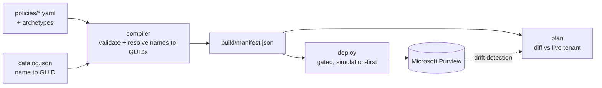

# Architecture

How the system is built and why it behaves the way it does. For the argument behind it see
[rationale.md](rationale.md); for per-field language detail see
[dsl-reference.md](dsl-reference.md).

## Contents

- [The pipeline](#the-pipeline)
- [Notes on the substrate](#notes-on-the-substrate)
- [The language](#the-language)
- [The natural-language layer](#the-natural-language-layer)
- [Safety model and non-guarantees](#safety-model-and-non-guarantees)
- [Open problems](#open-problems)

## The pipeline

Each stage has a fixed contract:

| Stage | Entry point | Input | Output | Tenant access | Host |
|---|---|---|---|---|---|
| Author | `policies/*.yaml` | prose requirement | YAML policy | none | any |
| Compile | `compiler/compile.py` | policies, archetypes, catalog | `build/manifest.json` | none | any |
| Plan | `powershell/Invoke-Plan.ps1` | manifest | diff report | read-only | Windows |
| Deploy | `powershell/Invoke-Deploy.ps1` | manifest | tenant mutation | read/write | Windows |
| Drift | `powershell/Export-DlpConfig.ps1` | live tenant | export, then a PR on divergence | read-only | Windows |

Compilation merges any referenced archetype beneath the policy, validates the result against
`compiler/schema/policy.schema.json`, resolves every friendly name to its GUID, and emits both the
cmdlet envelope parameters and the `AdvancedRule` JSON for each rule.

The Windows requirement is imposed by `Connect-IPPSSession`, which Security & Compliance PowerShell
only ships for Windows. It applies to the three tenant-facing stages and to nothing else. The
compiler and the test suites are pure Python and run anywhere, which is why `validate` runs on
Linux in CI while `plan`, `deploy`, and `drift` run on `windows-latest`.

## Notes on the substrate

A declarative model is only as good as its fidelity to the system it abstracts, and that fidelity
is not obtainable from vendor documentation. The behaviours below were established empirically
against a live tenant. Each one forced a change in the deploy engine, and together they are the
strongest available argument that DLP is structured enough to deserve a compiler: these are not
incidental quirks, they are constraints that any correct implementation has to encode.

**Finding 1. `Set-DlpComplianceRule -AdvancedRule` is rejected.** The service returns a generic
server-side error. There is no supported path to update the detection logic of an existing
`AdvancedRule` rule in place.

**Finding 2. `Remove-DlpComplianceRule` is asynchronous.** A removed rule does not disappear. It
enters `Mode=PendingDeletion` and remains visible for some time, and creating a rule with the same
name while it lingers fails with an "already exists" error.

*Consequence of 1 and 2.* Rule reconciliation is create-or-leave, never update. Since a rule cannot
be modified and cannot be safely replaced, an existing rule is left untouched. Changing detection
logic means giving the rule a new name. A rule found in `PendingDeletion` is skipped and its policy
is reported incomplete rather than being retried into a guaranteed failure. This is the single
largest concession the design makes to the substrate, and the ergonomic cost is treated as
unresolved under [open problems](#open-problems).

**Finding 3. Policy and rule names are case-insensitive.** `My-Rule` and `my-rule` are the same
object. Name comparison during reconciliation is therefore case-insensitive throughout, since a
case-sensitive lookup would conclude a rule is absent and then fail to create it as a duplicate.

**Finding 4. Microsoft 365 Copilot uses a different creation shape.** Copilot is a DLP location, but
it is not addressed by an `-XLocation` parameter like every other surface. It requires a
`-Locations` JSON document specifying `Workload="Applications"` and `Location="Copilot.M365"`, with
one `IndividualResource` inclusion per in-scope user, together with
`-EnforcementPlanes @("CopilotExperiences")`.

**Finding 5. A Copilot rule must carry a restrict action.** Creation without one fails with
`ErrorMissingRestrictActionForCopilotException`. The parameter is typed `Hashtable[]`, so the
compiler emits `RestrictAccess = @(@{value="Block"})`. The value-only shape is deliberate: adding a
`setting` key alongside a `HasActivity` condition is rejected with
`InvalidRestrictAccessActionWithHasActivityCondition`, while the value-only form is accepted either
way.

**Finding 6. Deployment scripts must be pure ASCII.** Windows PowerShell 5.1 reads a script without a
byte-order mark as ANSI. A single non-ASCII byte inside a string literal, such as a typographic dash
pasted from a document, corrupts parsing in ways whose error messages point nowhere near the actual
cause. All files under `powershell/` are constrained to ASCII and checked.

Two engine-level behaviours follow from operating against a service that fails this way. A policy
that errors is recorded and skipped rather than aborting the run, since one malformed policy should
not prevent nine correct ones from deploying; the run reports `N deployed, N skipped, N failed` and
exits non-zero if any failed. Pruning of undeclared rules is suppressed unless every desired rule is
confirmed in place, so that a partially reconciled policy is never stripped down to no rules at all.
The enforcement gate is the one condition that halts the entire run.

## The language

A policy is a single YAML document. The schema at `compiler/schema/policy.schema.json` is
authoritative; [dsl-reference.md](dsl-reference.md) documents every field.

Archetypes in `archetypes/` carry reusable defaults, so a pattern such as "simulation only, fenced
to a pilot group" is written once and inherited, with policy keys overriding archetype keys.

The language does not cover everything Purview's `AdvancedRule` grammar can express, and pretending
otherwise would produce a language that is either endless or dishonest. The `rawAdvancedRule` field
is a deliberate escape hatch: it accepts a verbatim `AdvancedRule` JSON string with GUIDs already
embedded, bypassing structured authoring and name resolution. Its presence is a concession rather
than a gap. A DSL over a large vendor surface without an escape hatch forces users to abandon the
tool entirely the first time they need something it cannot say, and an escape hatch that is
documented and narrow is better than a language that quietly cannot be adopted. Policies using it
give up fail-closed resolution for that rule, which is the cost, and it is why the field exists at
the rule level rather than the policy level.

## The natural-language layer

An assistant layer turns plain-English requests into policy drafts and answers questions about
existing coverage. This is the part of the system where a stated design position matters most,
because the obvious objection to pointing a language model at security policy is the correct one:
models produce plausible output, and plausible is precisely the failure mode
[rationale.md](rationale.md#1-position) identifies as undetectable.

The design claim is that model output is untrusted input, and the compiler is the trust boundary.

`assistant/validator.py` pushes every draft through `compile_policy`, the same function a
hand-written policy goes through, along the same path: YAML parse, archetype merge, schema
validation, fail-closed name resolution, `AdvancedRule` construction. A draft that does not survive
that path cannot become a pull request. The model is therefore not trusted to produce correct
policy. It is trusted only to produce a candidate, and every property the compiler enforces for
human authors is enforced identically for it. A hallucinated sensitive information type is not a
subtle downstream bug; it is a `ResolutionError` at the same line of the same resolver that would
reject a human typo.

The model itself is a replaceable component. `Brain` in `assistant/brain.py` is the single interface
a backend implements, with three implementations behind it: `LocalBrain` for any OpenAI-compatible
endpoint such as Ollama or vLLM, `ClaudeBrain` for the Anthropic API, and `DryRunBrain`, which
implements the interface while calling no model at all. `DryRunBrain` matters more than it appears
to. It emits a real, schema-valid, resolvable draft, which means the entire path from context
assembly through validation can be exercised with no API key, no network, and no cost, and it is
what makes the layer testable rather than merely demonstrable.

Whether a given model is good enough is treated as an empirical question. `assistant/eval.py` runs
each golden-example request through a brain, pushes every draft through the real compiler, and
reports a compile rate, along with the requests where the model asked a clarifying question instead
of guessing. It exits non-zero if any produced draft fails to compile, so it can serve as a CI gate.

The limitation is stated plainly in the tool itself: compile rate measures form, not intent. It
answers whether a draft would deploy, not whether it does what was asked. A policy that compiles
perfectly and watches the wrong sensitive information type is exactly the silent failure this
project exists to prevent, and no automated check in this repository detects it. That is what the
mandatory pull request is for. The compiler establishes that a draft is well-formed and deployable;
a human establishes that it is right.

## Safety model and non-guarantees

The controls are as follows. Authored policies are simulation-first, and enforcement requires a
separate authorized run. Resolution fails closed, so unknown references break the build. Every
change lands through a pull request, and the deploy environment can require reviewers.
Authentication is app-only through GitHub OIDC, `azure/login`, and a certificate held in Azure Key
Vault, so no secret is stored in the repository.

What this does not give you matters just as much:

- **Drift is detected, not prevented.** Nothing stops an administrator editing a policy in the
  portal. The scheduled export notices divergence after the fact, on a daily cadence by default, and
  opens a pull request. Between the edit and the next run, the tenant and the repository disagree
  and nothing is aware of it.
- **The compiler cannot validate detection efficacy.** It proves a sensitive information type exists
  and resolves to a GUID. Whether that type matches your actual data, at the confidence level you
  chose, is outside what any offline check can determine.
- **Simulation telemetry is not consumed.** Policies deploy in test mode, but the match counts that
  mode produces are not read back, so the decision to enforce is still made by a human reading a
  portal rather than by evidence flowing through the pipeline.
- **The enforcement gate is a process control.** It stops an accidental enforcement, not a determined
  operator with tenant permissions.
- **A draft that compiles is not a draft that is correct.** See the natural-language layer above.

## Open problems

These are unsolved, not scheduled.

**Rule immutability.** Findings 1 and 2 mean detection logic cannot be edited, only renamed. This is
correct with respect to the service and unpleasant to live with, since it turns a one-character
threshold change into a rename that breaks continuity of the rule's history. Whether a
compiler-managed naming scheme could hide this without becoming a leaky abstraction is unresolved.

**Scope reconciliation.** Location and scope changes on an existing policy are not reconciled. The
deploy engine updates mode and comment and reports that it has not touched scoping. Correcting this
requires knowing which scope mutations the service accepts in place, which is another empirical
question of the kind the substrate findings catalogue.

**Closing the simulation loop.** The pipeline can deploy a policy in test mode but cannot read back
what it matched. Consuming that telemetry would let the enforcement decision be made from evidence,
and would turn simulation from a safety convention into a measurement.

**Intent evaluation.** Compile rate measures form. Nothing measures whether a generated policy
expresses the request. This may require golden pairs of request and intended detection semantics,
compared structurally rather than textually.

**A second backend.** The portability claim in [rationale.md](rationale.md#4-beyond-purview) is
architectural and untested. Only implementing a non-Purview target would establish which parts of
the language are universal.

**Catalog freshness.** The catalog is refreshed manually. A stale catalog cannot cause a wrong
policy, since resolution fails closed, but it does cause build failures whose real cause is
staleness rather than the policy being compiled.
